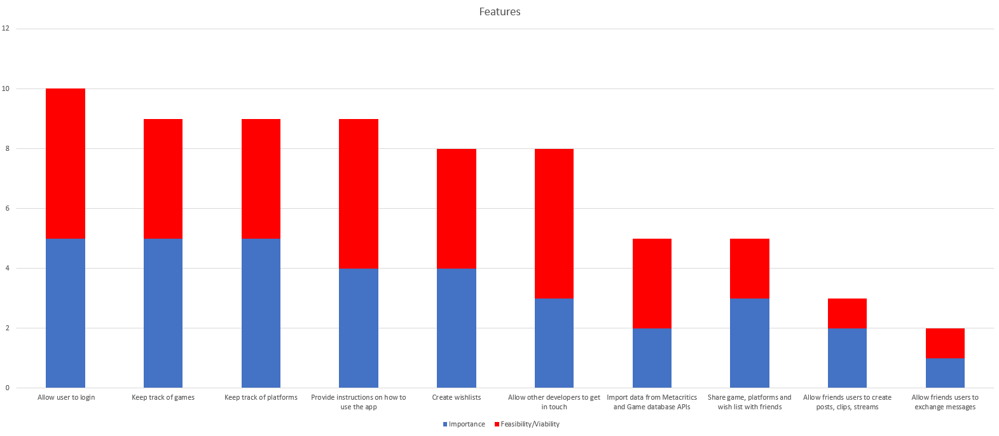
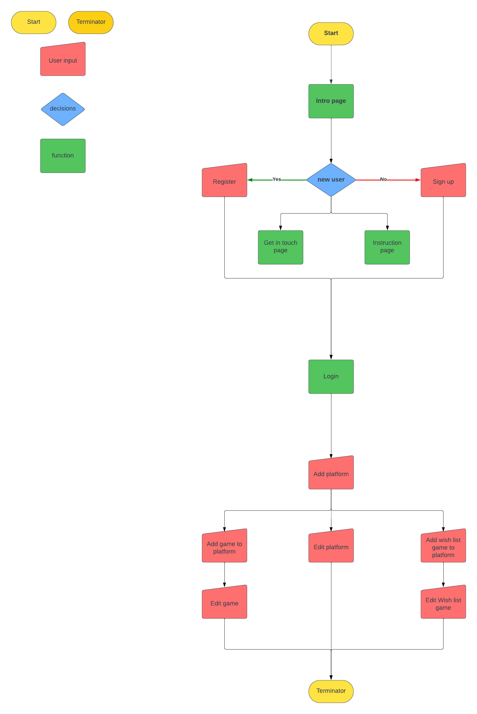
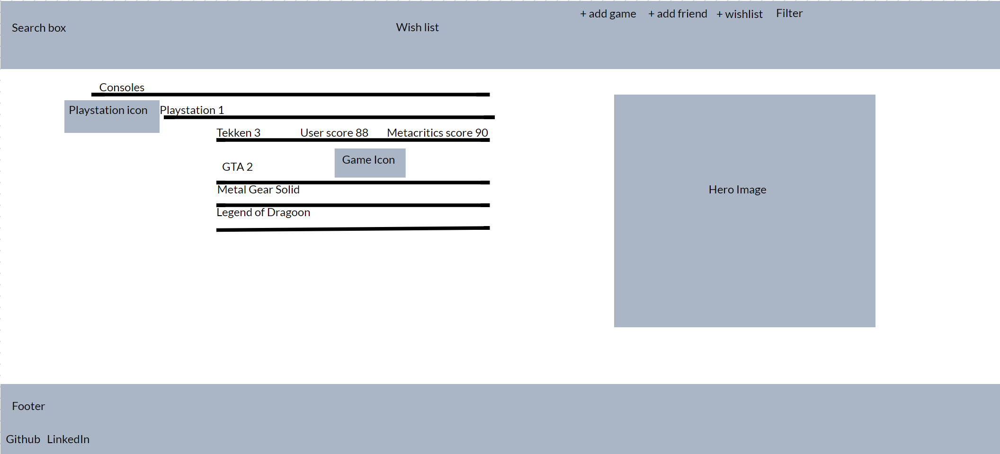
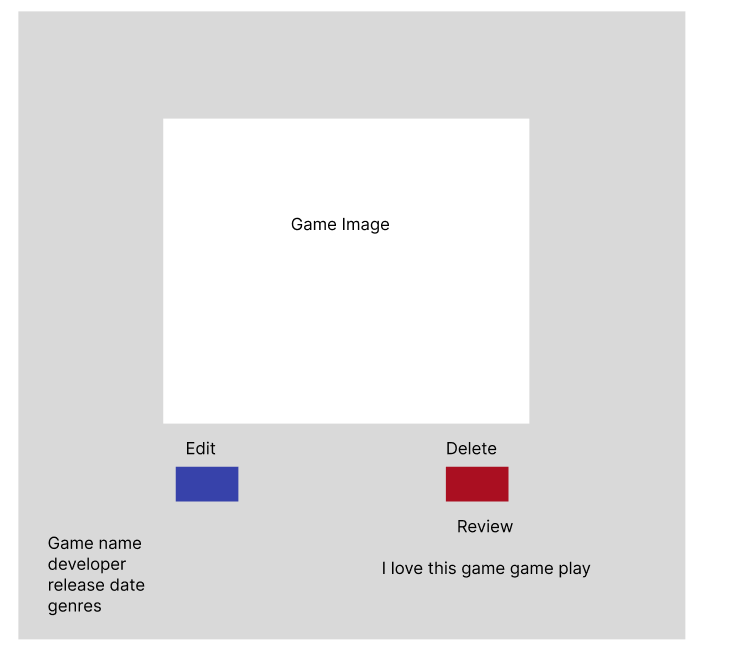
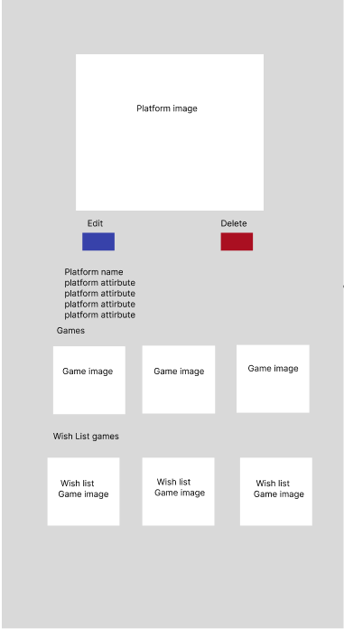
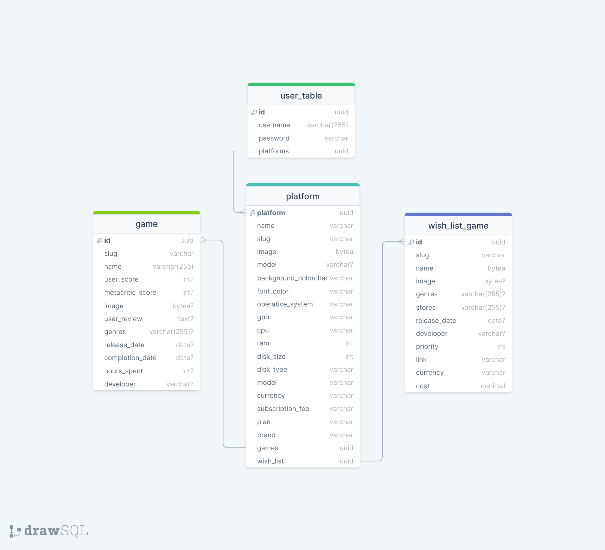
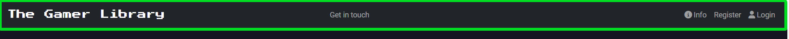
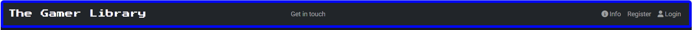
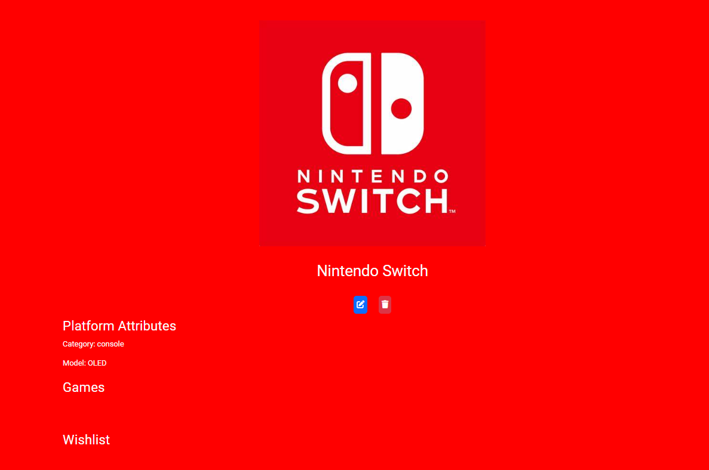

# The Gamer Library

---

## Site Overview

---
Immerse yourself in your passion for gaming with The Gamer Library, an app meticulously crafted to unite your gaming journey across generations and platforms. As a fellow gamer, my gaming odyssey began with the early days of Sonic 2 on the Sega Mega Drive and has continued, spanning up to the latest adventure in Baldur's Gate III.

Understanding the challenges of hardcore gamers in keeping track of their extensive gaming history, The Gamer Library aims to provide a comprehensive solution. In today's digital era, games are available in various formats and scattered across different platforms, each maintaining an independent record. This challenge becomes evident, for example, when attempting to reconcile games played on Game Pass with those in the Steam library. With the rise of cloud gaming, titles frequently shift between platforms, making it easy to lose track of your gaming history.

Adding a game to The Gamer Library goes beyond mere organization; it enhances your gaming satisfaction. There's a unique sense of achievement in conquering the final boss and proudly recording your triumph in the library. Moreover, it takes users on a nostalgic journey, linking specific games to significant moments. I vividly recall playing Digimon World 3 on PS1 when my sister was born, conquering Ornstein and Smough in Dark Souls during my Master's degree, exploring the City of Tears in Hollow Knight with my first job, and immersing myself in Baldur's Gate III builds while crafting this very project.

Embark on a new chapter of gaming with The Gamer Library to celebrate your games! Join The Gamer Library and redefine how you experience and share your love for gaming!

Live link to [The Gamer Library](https://the-gamer-library-a2d80d9a63a6.herokuapp.com/)


## Table of Contents

- [The Gamer Library](#the-gamer-library)
  - [Site Overview](#site-overview)
  - [Table of Contents](#table-of-contents)
  - [Planning phase](#planning-phase)
    - [Strategy plane](#strategy)
      - [Aims](#aims)
      - [Opportunities](#opportunities)
    - [Scope](#scope)
    - [Structure](#structure)
      - [User stories](#user-stories)
    - [Skeleton](#skeleton)
      - [Wireframes](#wireframes)
      - [Database schema](#database-schema)
    - [Surface](#surface)
      - [Colors](#colors)
      - [Typography](#typography)
  - [Features](#features)
  - [Bugs](#bugs)
  - [Diary](#diary)

---

## Planning phase

---

### Strategy

---

#### Aims

The Gamer Library efficiently catalogues all played games and the diverse platforms users have experienced. In today's gaming landscape, options include PCs, streaming services, consoles, and cloud gaming platforms.

The core objective of The Gamer Library is to empower gamers by facilitating meticulous tracking of their gaming history and the corresponding platforms. Beyond this, the platform acknowledges that each gaming service, console, or PC carries its own cost. With The Gamer Library, users can effortlessly monitor the number of games played on each platform, enabling them to evaluate the continued value of associated fees.

Furthermore, The Gamer Library enhances user experience by offering the ability to curate a wish list. Users can add desired games and even analyze the wish-listed titles on each platform. This functionality aids in strategic decision-making, helping users identify the most convenient platform based on the quantity and priority of wish-listed games.

#### Opportunities

In the table and plot below, you'll find a comprehensive list of features that emerged during the brainstorming step.

| Opportunity/Problem                                 | Importance | Feasibility/Viability |
|-----------------------------------------------------|------------|-----------------------|
| Keep track of games                                 | 5          | 4                     |
| Keep track of platforms                             | 5          | 4                     |
| Create wishlists                                    | 4          | 4                     |
| Allow user to login                                 | 5          | 5                     |
| Provide instructions on how to use the app          | 4          | 5                     |
| Allow other developers to get in touch              | 3          | 5                     |
| Import data from Metacritics and Game database APIs | 2          | 3                     |
| Share game, platforms and wish list with friends    | 3          | 2                     |
| Allow friends users to exchange messages            | 1          | 1                     |
| Allow friends users to create posts, clips, streams | 2          | 1                     |



### Scope

---

Due to the limited time available, I will focus on implementing features where Importance (I) + Feasibility (F) has the highest value:

- UX **must** address:
  - Allow user to login  
  - Keep track of games
  - Keep track of platforms

- UX **should** address:
  - Create wishlists
  - Provide instructions on how to use the app
  - Allow other developers to get in touch
  - Allow friends users to exchange messages

- UX **could** address:
  - Import data from Metacritics and Game database APIs
  - Share game, platforms and wish list with friends

- UX **wont** address:
  - Allow friends users to create posts, clips, streams
  - Allow friends users to exchange messages

### Structure

---
The graphic below illustrates the steps a user should take to use The Gamer Library app. I created it using `Lucidchart`.



#### User Stories

I developed The Gamer Library project by following Agile principles. I worked in sprints of 2 weeks each, and at the end of each sprint, I introduced new user stories or rescheduled previous user stories following the MoSCoW rules.

##### Sprint 1

##### 18/12/2023 - 25/12/2023

- **Must have**
  - As a **Developer** I can**access the project on the cloud** so that I **can view and navigate the app on Heroku, just as I do locally**.
  - As a **Admin** I can **create, read, update, and delete platform instances** so that I **can perform CRUD operations on platforms**.
  - As a **Admin** I can **create, read, update, and delete games instances** so that I **can perform CRUD operations on games**.

- **Should have**
  - As a **Admin** I can **See the list of platforms added outside the admin panel** so that I **can verify the platform list view and home page perform as expected**.
  - As a **Admin** I can **See the list of games added outside the admin panel** so that I **can verify the game list view and html template perform as expected**.

##### Sprint 2

##### 25/12/2023 - 08/01/2024

- **Must have**
  - As a **User** I can **add a platform to the app** so that I **can keep track of the platforms I use**.
  - As a **User** I can**add Games to a Platform** so that I **can keep track of the games played on each platform**.

- **Should have**
  - As a **User** I can **log into the app** so that I **can see only my list of platforms and games**.
  - As a **Developer** I can **showcase who I am and my history** so that I **can empathize with the user**.
  
- **Could have**
  - As a **Developer** I can **get in touch with recruiters or other developers** so that I **can receive offers to work on new projects or receive feedback**.

##### Sprint 3

##### 08/01/2024 - 22/01/2024

- **Must have**
  - As a **User** I can **edit a platform instance** so that **I can update the platform or correct mistakes added during creation**.
  - As a **User** I can **delete a platform instance** so that **I can remove platforms from the app**.

- **Could have**
  - As a **Developer** I can **test that a platform is created and its details are visible** so that **I can perform platform CRUD testing without manual intervention**.
  - As a **Developer** I can **verify that the 'Get in Touch' content is displayed without manual testing** so that I can **save time during app testing**.

##### Sprint 4

##### 22/01/2024 - 05/02/2024

- **Must have**
  - As a **User** I can **see game details** so that **I can get information and details on the games I have played**.
  - As a **User** I can **add images to my games** so that **I can customize the game instances I add**.

- **Should have**
  - As a **User** I can **edit my game details** so that **I can customize my games instances**.
  - As a **User** I can **delete a game instance** so that **I can remove unwanted games from my game list**.

##### Sprint 5

##### 05/02/2024 - 19/02/2024

- **Must have**
  - As an **Admin** I can **add wishlist instances** so that **I can manage and view wishlist items from the admin panel**.
  - As a **User** I can **add wishlist items** so that **I can plan and keep track of the games I want to buy**.

- **Should have**
  - As a **User** I can **edit a wishlist item** so that **I can update details such as price and priority**.
  - As a **User** I can **delete wishlist items** so that **I can remove a game I no longer want to buy**.

- **Could have**
  - As a **User** I can **access instructions on how to use the app** so that **I do not feel lost when navigating the home page**.
  - As a **User**, I can **understand what the purpose of the app is** so that **I can decide if it fits my needs**.
  - As a **Developer** I can **test creating, reading, updating, and deleting Platform instances** so that **I can test Platform CRUD without manual input**.
  - As a **Developer** I can **test creating, reading, updating, and deleting Game instances** so that **I can test Game CRUD without manual input**.
  - As a **Developer** I can **test creating, reading, updating and deleting WishListGames instances** so that **I can test WishListGame CRUD without manual input**.
  - As a Developer I can test forms' validity without manual input so that I can speed up and automate the app testing.

##### Sprint 6

##### 19/02/2024 - 29/02/2024

- **Must have**
  - As a **User** I can **access all the details on the app's purpose, planning, and functions** so that **I can make an informed decision on whether it meets my needs**.

- **Should have**
  - As a **Developer** I can **analyze the test coverage percentage for views and forms** so that **I can prioritize manual testing efforts on uncovered areas**.

  - As a **User** I can **seamlessly access the game store directly from the wishlist section of the app** so that **I can conveniently purchase desired games without switching between platforms**.

##### Backlog

- **Wont have**
  - As a **User** I can **add friends to the app** so that **I can share games, platforms and wishlists with them**.
  - As a **User** I can **get Metacritic score, released date, developer and genres fields automatically filled** so that **I can speed up the adding game step**.
  - As a **User** I can **add posts, streams, and game clips** so that **I can share them with friends**.

### Skeleton

---

#### Wireframes

Below are the wireframes I used to create the .html templates for the app.





#### Database schema

Below is the schema I used to implement the main model of The Gamer Library


### Surface

---

#### Colors

Gamers are the primary target audience for The Gamer Library; therefore, I have chosen colours that immerse users in the gaming world. Indeed, an RGB border surrounds the Navbar that continuously changes colour.




Each gaming console/brand has a distinct colour: red for Nintendo Switch, green for Xbox, and blue for PlayStation 5. Therefore, I allowed the users to personalize the background colour for each platform. This colour choice influences the platform box colour on the home page and serves as the background colour on the platform detail page. If a user selects a dark colour as the background, the font in the platform box and platform detail page will not be visible. Therefore, users can change the font colour for the platform box on the home page and the platform detail page



For more information, refer to the [Features](#features) section.

#### Typography

As font I chose a font which reminds of gaming `Press Start 2 Play`to create the logo and one which combined accordingly `Roboto` for the main content of the app

---

## Features

---

## Bugs

1. **Error**:
  
    ```cmd
    File "<frozen importlib._bootstrap_external>", line 1074, in get_code
    File "<frozen importlib._bootstrap_external>", line 1004, in source_to_code
    File "<frozen importlib._bootstrap>", line 241, in _call_with_frames_removed
    File "C:\Users\Mary9\OneDrive\Documenti\angelo\The-Gamer-Library\gamer_library\settings.py", line 21
      TEMPLATES_DIR os.path.join(BASE_DIR, 'templates')
    SyntaxError: invalid syntax
    ```

    **Cause** missing = in:

    ```python

      SECRET_KEY os.environ.get('SECRET_KEY')
    ```

    **Solution** added = in setting .py , code is now:

    ```python

    SECRET_KEY = os.environ.get('SECRET_KEY')
    ```

1. **Error**:

   ```cmd
    File "C:\Users\Mary9\OneDrive\Documenti\angelo\The-Gamer-Library\env.py", line 6, in <module>
      os.environ["LOCALHOST"]= ["127.0.0.1"]
      ~~~~~~~~~~^^^^^^^^^^^^^
    File "<frozen os>", line 684, in __setitem__
    File "<frozen os>", line 744, in check_str
   TypeError: str expected, not list
   ```
  
    **Cause**: variable LOCALHOST was set as a list rather than as a string

      ```python
      os.environ["LOCALHOST"]= ["secret_string"]
      ```

    **Solution**: turned list into string

      ```python
      os.environ["LOCALHOST"]= "secret_string"
      ```

1. **Error**:

   ```bash
    django.core.exceptions.ImproperlyConfigured: In order to use cloudinary storage, you need to provide CLOUDINARY_STORAGE dictionary with CLOUD_NAME, API_SECRET and API_KEY in the settings or set CLOUDINARY_URL variable (or CLOUDINARY_CLOUD_NAME, CLOUDINARY_API_KEY, CLOUDINARY_API_SECRET variables).
    !Error while running '$ python manage.py collectstatic --noinput'.
    See traceback above for details.
    You may need to update application code to resolve this error.
    Or, you can disable collectstatic for this application:
   ```

    **Cause**: Cloudinary settings were set as

      ```python
      os.environ["CLOUDINARY_URL"]= "my_cloudinary_url"
      ```

    **Solution**: added in settings.py :

    ```python
        CLOUDINARY_STORAGE = {
        'CLOUD_NAME': os.environ.get('CLOUDINARY_CLOUD_NAME'),
        'API_KEY': os.environ.get('CLOUDINARY_API_KEY'),
        'API_SECRET': os.environ.get('CLOUDINARY_API_SECRET'),
    }
    ```

    and the related key in env.py

    ```python
    os.environ["CLOUDINARY_CLOUD_NAME"] = "my_cloud_name"
    os.environ["CLOUDINARY_API_KEY"] = "my_API_key"
    os.environ["CLOUDINARY_API_SECRET"] = "my_API_secret_key"
    ```

1. **Error**:

    ```bash
        File "/app/.heroku/python/lib/python3.12/site-packages/cloudinary/utils.py", line 740, in build_distribution_domain
              raise ValueError("Must supply cloud_name in tag or in configuration")
          ValueError: Must supply cloud_name in tag or in configuration
    !     Error while running '$ python manage.py collectstatic --noinput'.
          See traceback above for details.
          You may need to update application code to resolve this error.
          Or, you can disable collectstatic for this application:
              $ heroku config:set DISABLE_COLLECTSTATIC=1
          https://devcenter.heroku.com/articles/django-assets
    !     Push rejected, failed to compile Python app.
    !     Push failed
    ```

    **Cause**: DISABLE_COLLECTSTATIC was named incorrectly in heroku, it was DISABLE_COLLEC
    STATIC =1

    **Solution**: deleted config var DISABLE_COLLEC
    STATIC =1 and added  DISABLE_COLLECTSTATIC=1

1. **Error**:
    many to many relation is not visible in admin panel

   **Cause**:
    many to many rleation have been created using cross-tables
    user-games, user-wishlist

    **Solution**:
      used ManyToManyField rather than cross table

1. **Error**:
    Many to many relation does not take into consideration game custom fields such as user score and user review

    **Cause**:
    Use of many-to-many relation rather than one-to-many

    **Solution**:
    changed many to many relation into one to many in the following:
    user-games is now one to many
    user-wishlists is now one to many
    added plaltform table
    user-platform is one to many
    platform-games is one to many
    platform-wishlists os one to man

1. **Error**:

    ```cmd
      ERRORS:
      <class 'library.admin.PlatformAdmin'>: (admin.E020) The value of 'filter_horizontal[0]' must be a many-to-many field.
      <class 'library.admin.PlatformAdmin'>: (admin.E020) The value of 'filter_horizontal[1]' must be a many-to-many field.
      <class 'library.admin.UserProfileAdmin'>: (admin.E013) The value of 'filter_horizontal[0]' cannot include the ManyToManyField 'friends', because that field manually specifies a relationship model.
      <class 'library.admin.UserProfileAdmin'>: (admin.E020) The value of 'filter_horizontal[1]' must be a many-to-many field.
      <class 'library.admin.UserProfileAdmin'>: (admin.E020) The value of 'filter_horizontal[2]' must be a many-to-many field.
      <class 'library.admin.UserProfileAdmin'>: (admin.E020) The value of 'filter_horizontal[3]' must be a many-to-many field.
      library.Platform.games: (fields.E303) Reverse query name for 'library.Platform.games' clashes with field name 'library.Game.platform'.
              HINT: Rename field 'library.Game.platform', or add/change a related_name argument to the definition for field 'library.Platform.games'.
      library.Platform.wishlists: (fields.E303) Reverse query name for 'library.Platform.wishlists' clashes with field name 'library.WishList.platform'.
              HINT: Rename field 'library.WishList.platform', or add/change a related_name argument to the definition for field 'library.Platform.wishlists'.
   ```

   **Cause**
   filter orizontal was set in `UserProfile` for `games`, `whishlists` and `platforms` model although they the releation between user profile and  `games`, `whishlists` and `platforms` was one to many.
   filter orizontlal was set also for `FriendList` model but friendlist model has trough attribute

    ```python
    filter_horizontal = ('friends', 'games', 'wishlists', 'platforms')
    ```
  
    The error also complaints about a clash between the foreign key used in the `Platform model`

    ```python
    class Platform(models.Model):
    id = models.UUIDField(primary_key=True, default=uuid.uuid4, editable=False)
    platform_name = models.CharField(max_length=255)
    platform_image = models.ImageField(null=True,  blank=True)
    games = models.ForeignKey('Game', on_delete=models.CASCADE, blank=True)
    wishlists = models.ForeignKey('WishList', on_delete=models.CASCADE,  blank=True)
    ```
  
    **Solution**
    filrer orizantal was removed in `admin.py` for `UserProfile` model
    related name attribute added to platform model for the foreign keys

    ```python
    class Platform(models.Model):
    id = models.UUIDField(primary_key=True, default=uuid.uuid4, editable=False)
    platform_name = models.CharField(max_length=255)
    platform_image = models.ImageField(null=True,  blank=True)
    games = models.ForeignKey('Game', on_delete=models.CASCADE, blank=True, related_name='games' )
    wishlists = models.ForeignKey('WishList', on_delete=models.CASCADE,  blank=True, related_name='wish_list')
    ```

1. **Error**:

   ```cmd
    IntegrityError at /admin/library/platform/add/
    null value in column "games_id" of relation "library_platform" violates not-null constraint
    DETAIL:  Failing row contains (c64c5653-4b10-4f1c-a68d-cf1754346e90, Game Pass, , null, null, null).
    Request Method:POST
    Django Version:5.0
    Exception Type:IntegrityError
    Exception Value:
    null value in column "games_id" of relation "library_platform" violates not-null constraint
    DETAIL:  Failing row contains (c64c5653-4b10-4f1c-a68d-cf1754346e90, Game Pass, , null, null, null).
    Exception Location:
   ```

   **Cause**:
    Games is Foreign key for platfrom and is not set to null=true

    **Solution**:
    Added null= True to the game and wish list ForeignKey

    ```python
    games = models.ForeignKey(Game, on_delete=models.CASCADE, null=True, blank=True)
    ```

1. **Error**:
    The template platform_list.html does not show platform created

    **Cause**:
    Platform attributes were called incorrectly in .html template

    ```html
      <h1>Platforms list</h1>
      
        <h2>{{platform.name}}</h2>
        <p>{{plaform.model}}</p>
      
    ```

    **Solution**:
    Corrected platform instance attribute name in .html template

    ```html
     <h1>Platforms list</h1>
      
        <h2>{{platform.platform_name}}</h2>
        <p>{{platform.platform_model}}</p>
      
    
    ```

1. **Error**

   ```cmd
      TemplateDoesNotExist at /add_platform/
      add_platform.html
      Request Method:GET
      Django Version:5.0
      Exception Type:TemplateDoesNotExist
      Exception Value:
      add_platform.html
   ```

   **Cause**
   Template file name was missing from add `platform view`

   **Solution**
   Added add platform template to add platform view:

   ```python
      def add_platform(request):
        platform_form = AddPlatformForm()

        if request.method == 'POST':
            platform_form = AddPlatformForm(request.POST)
            if platform_form.is_valid():
                platform_form.save()
                # Add any additional logic or redirect here
                return redirect('')

        return render(request,
                      'library/add_platform.html',
                      {'platform_form': platform_form})
   ```

1. **Error**

   ```cmd
    django.db.utils.ProgrammingError: Problem installing fixture ': Could not load library.Platform(pk=00000000-0000-0000-0000-000000000001): column "user_id" of relation "library_platform" does not exist
    LINE 1: ...g', "box_color" = NULL, "font_color" = '#fafafa', "user_id" ...
   ```

   **Cause**
   Database was corrupted

   **Solution**
   reset database on elephant sql

1. **Error**

   ```cmd
   django.urls.exceptions.NoReverseMatch: Reverse for 'collaborate' not found. 'collaborate' is not a valid view function or pattern name.
   ```

   **Cause**
   url was missing in url.py

   **Solution**

   ```python
      path('collaborate/', views.collaborate, name='collaborate'),
   ```

1. **Error**

   ```cmd
    UnboundLocalError at /game-pass/edit_platform/00000000-0000-0000-0000-000000000001/
    cannot access local variable 'platform' where it is not associated with a value
    Request Method:GET
    Request URL:http://127.0.0.1:8000/game-pass/edit_platform/00000000-0000-0000-0000-000000000001/
    Django Version:5.0
    Exception Type:UnboundLocalError
    Exception Value:
    cannot access local variable 'platform' where it is not associated with a value
    Raised during:library.views.edit_platform
    Python Version:3.11.4
   ```

    **Cause**
    In view.py form was named `edit_platform_form` but variable `form` was called in html template

    **Solution**
    named form as `edit_platfotm_form` in views.py and called variable `edit_platfotm_form` in html

    ```html
    <form method="post"  class='white-text' action="">
      
      {{ edit_platform_form|crispy }}
      <button type="submit">Save</button>
    </form>
    ```
  
1. **Error**

    ```cmd
    Page not found (404)
    No Platform matches the given query.
    Request Method:GET
    Request URL:http://127.0.0.1:8000/steam/undefined
    Raised by:library.views.platform_detail
    ```

    **Cause**
    `platform.id` was assigned as a attribute to the modal button rather than to the delete button

    **Solution**
    added `platform.id` to the delete button element

    ```html
    <div class="text-center white-text">
      <button class="btn btn-delete btn-danger white-text" data-platformid="{{ platform.id }}" id="deleteButton">Delete</button>
    </div>
    ```

1. **Error**

    ```cmd
    library\Lib\site-packages\django\utils\module_loading.py", line 25, in import_string
    module_path, class_name = dotted_path.rsplit(".", 1)
                              ^^^^^^^^^^^^^^^^^^
    AttributeError: 'tuple' object has no attribute 'rsplit'
    ```

    **Cause**
    Application of pep8 rule in `setting.py`:

    ```python
        AUTH_PASSWORD_VALIDATORS = [
        {
            'NAME': ('django.contrib.auth.password_validation.'
                    'UserAttributeSimilarityValidator'),
        },
        {
            'NAME': ('django.contrib.auth.password_validation.'
                    'MinimumLengthValidator'),
        },
        {
            'NAME': ('django.contrib.auth.password_validation.'
                    'CommonPasswordValidator'),
        },
        {
            'NAME': ('django.contrib.auth.password_validation.'
                    'NumericPasswordValidator',)
        },
    ]
    ```

    **Solution**
    To restore default in settings.py solved the issue:

    ```python
      AUTH_PASSWORD_VALIDATORS = [
      {
          'NAME': 'django.contrib.auth.password_validation.UserAttributeSimilarityValidator',
      },
      {
          'NAME': 'django.contrib.auth.password_validation.MinimumLengthValidator',
      },
      {
          'NAME': 'django.contrib.auth.password_validation.CommonPasswordValidator',
      },
      {
          'NAME': 'django.contrib.auth.password_validation.NumericPasswordValidator',
      },
    ]
    ```

1. **Error**
     Adding a new platform returns error:

    ```cmd
      django.db.utils.IntegrityError: null value in column "user_id" of relation "library_platform" violates not-null constraint
      DETAIL: Failing row contains (4b4415a6-8d18-47c0-addf-9d15235bdb82, test, test, pc, placeholder, null, #fafafa, null).
    ```

   **Cause**
    Platform model has been update so that user is a foreign key of platform, therefore when a new platform is added a user is required

    **Solution**
    `login_required` decorator has been added to the view and user is passed during the form save function

    ```python
      @login_required
      def add_platform(request):
      if request.method == 'POST':
          add_platform_form = AddPlatformForm(request.POST)
          if add_platform_form.is_valid():
              add_platform_form.save(user=request.user)
              messages.add_message(request, messages.SUCCESS,
                                  'new platform added')
              return redirect('home')
          else:
              messages.error(request, 'Error adding the platform. Please check'
                            'the form.')
      else:
          add_platform_form = AddPlatformForm()

      return render(request,
                    'library/add_platform.html',
                    {'add_platform_form': add_platform_form})
    
    ```
  
1. **Error**

     ```cmd
     TypeError at /3r23r23r/delete_platform/6463b2fe-6a98-43ec-9817-9bbc33b30222/
     delete_platform() got an unexpected keyword argument 'slug'
     ```

   **Cause**
   Url to delete platform required 'slug' as parameter but slug was removed from delete_platform view

   **View**
   Added url back to delete_platform view

1. **Error**
  Expand button is expanding on `index.html` is expanding but collapsing

   **Cause**
    Interference between bootstrap imported in `base.html`

    ```html
      <script src="https://cdn.jsdelivr.net/npm/@popperjs/core@2.11.8/dist/umd/popper.min.js" integrity="sha384-I7E8VVD/ismYTF4hNIPjVp/Zjvgyol6VFvRkX/vR+Vc4jQkC+hVqc2pM8ODewa9r" crossorigin="anonymous"></script>
      <script src="https://cdn.jsdelivr.net/npm/bootstrap@5.3.2/dist/js/bootstrap.min.js" integrity="sha384-BBtl+eGJRgqQAUMxJ7pMwbEyER4l1g+O15P+16Ep7Q9Q+zqX6gSbd85u4mG4QzX+" crossorigin="anonymous"></script>
      <script src="https://cdn.jsdelivr.net/npm/bootstrap@5.3.2/dist/js/bootstrap.bundle.min.js" integrity="sha384-C6RzsynM9kWDrMNeT87bh95OGNyZPhcTNXj1NW7RuBCsyN/o0jlpcV8Qyq46cDfL" crossorigin="anonymous"></script>
      <script src=""></script>
    ```

    **Solution**
    kept Boostrap bundle which includes popper and Bootstrap and removed lines the other two lines

   ```html
     <script src="https://cdn.jsdelivr.net/npm/bootstrap@5.3.2/dist/js/bootstrap.bundle.min.js" integrity="sha384-C6RzsynM9kWDrMNeT87bh95OGNyZPhcTNXj1NW7RuBCsyN/o0jlpcV8Qyq46cDfL" crossorigin="anonymous"></script>
   ```
  
1. **Error**
     If a user tries to add a `platform` with the same name of the platform of another user gets error:

     ```cmd
     IntegrityError at /add_platform/
    duplicate key value violates unique constraint "library_platform_slug_key"
      DETAIL:  Key (slug)=(test) already exists.
    ```

    **Cause**
    URL for `platform details`, `add platform` and `remove platform` is designed to include only slug, which will be the same if two user Add the same platform name.

    **Solution**
    Added `user id` to the url for `platform details`, `add platform` and `remove platform`

    ```python
    urlpatterns = [
        path('', views.PlatformList.as_view(), name='home'),
        path('add_game/', views.add_game, name='add_game'),
        path('add_platform/', views.add_platform, name='add_platform'),
        path('<int:user_id>/<slug:slug>/', views.platform_detail,
            name='platform_detail'),
        path('<int:user_id>/<slug:slug>/edit_platform/<uuid:platform_id>/',
            views.edit_platform, name='edit_platform'),
        path('<int:user_id>/<slug:slug>/delete_platform/<uuid:platform_id>/',
            views.delete_platform, name='delete_platform'),
    ]
    ```

1. **Error**
   Different users can see platforms of other users, when adding a game to platform

   **Cause**
   Platforms were not filtered in forms.py for add game form

   **Solution**
   Added a filter to restrict view to only user owned platform in add_game form

   ```python
   def __init__(self, user, *args, **kwargs):
        super(AddGameForm, self).__init__(*args, **kwargs)
        # Filter platforms based on the current user
        self.fields['platform'].queryset = Platform.objects.filter(user=user)
   ```

1. **Error**
   Images are not uploaded to Cloudindary when uploaded via form

   **Cause**
  Form in html template and view were missing relevant fields

   **Solution**

    ```python
    @login_required
    def add_platform(request):
        if request.method == 'POST':
            add_platform_form = AddPlatformForm(request.POST, request.FILES)
            if add_platform_form.is_valid():
                platform_name = add_platform_form.cleaned_data['name']
    ```

    ```html
      <form method="post" class="white-text" enctype="multipart/form-data" action="">
        
        {{ add_platform_form|crispy }}
        <button type="submit" class="btn btn-primary">Add Platform</button>
    </form>

    ```

1. **Error**
    When creating the edit game form got error:

    ```cmd
    from .forms import (AddPlatformForm, EditPlatformForm, AddGameForm,)
    raise FieldError(
    django.core.exceptions.FieldError: 'completion_date' cannot be specified for Game model form as it is a non-editable field)

    ```

    **Cause**
    Field `auto_now_add=True` was added to the `Game` model if this is added the field is not editable

    **Solution**
    Changed `auto_now_add=True` to `default=models.functions.Now` to set current date as default and allow to edit the completion date

1. **Error**
   got the following error when creating the creating the `edit game` view

   ```cmd
   NoReverseMatch at /1/games-pass/test2/
   Reverse for 'edit_game' with arguments '(1, '', 'test2')' not found. 1 pattern(s) tried: ['(?P<user_id>[0-9]+)/(?P<platform_slug>[-a-zA-Z0-9_]+)/(?P<game_slug>[-a-zA-Z0-9_]+)/edit_game/\\Z']
   ```
  
   **Cause**
   The edit game button is added on the `game_detail.html` and to form the url the platform.slug attribute is required.
   Nevertheless, the `game_detail` view does not return the instance of the platform

   **Solution**
   Added the instance of platform in the return of `game_detail` view

   ```python
    user = request.user
      platform = get_object_or_404(Platform, user=user, slug=platform_slug)
      game = get_object_or_404(Game, platform=platform, slug=game_slug)

      return render(
          request,
          "library/game_detail.html",
          {
          "platform": platform,
          "game": game},
      )
   ```

1. **Error**
   Platform and Gamer slug does not change after edits and the url use the slug

    **Cause**
    After instance editing slug attribute does not get updated

    **Solution**
    Url use platform, game, and wishlist_game id rather than slug in the urls

## Diary

- ### Sprint 1
  
  - **11/12/2023**
    Add user stories template
    add labels
    add user stories
    add sprint 1
    add wireframe
    update feasibility importance plot
    start django project

  - **12/12/2023**
    set up early deployment
    documented bugs
    created and connected to postgresql
    connect to cloudinary
    successfull deployment on heroku

  - **15/12/2023**
    database schema creation
    database implementation

  - **16/12/2023**
    add manytomany relation on database
    deletion and recreation of database

  - **17/12/2023**
    changed many to many relation into one to many in the following:
    user-games is now one to many
    user-wishlists is now one to many
    added plaltform table
    user-platform is one to many
    platform-games is one to many
    platform-wishlists os one to many

  - **19/12/2023**
     add basic view and url
     allows to see the list of platforms available
     added template html to visualize platforms list

  - **20/12/2023**
     add summernote
     add fixture

  - **21/12/2023**
    reshape model adding platform subclasses

  - **25/12/2023**
     created base.html
     add boostrap
     add fontawesome

- ### Sprint 2

  - **26/12/2023**
  - add index.html
  - add javascript and jquery

- **27/12/2023**
  - add game list to index.html
  - remove foreign key from platform model

- **28/12/2023**
  - move static files from cloudinary to collectstic
  - add whitenoise
  
- **29/12/2023**
  - add view function for platform detail.html
  - add platform detail .html
  - add slug field to platforms
  - add style to platform detail.html
  - updates fixtures

- **30/12/2023**
  - add about app
  - add about url, views, settings model
  - add about template
  - style about template
  
- **31/12/2023**
  - add authentication
  - add authentication templates
  - add authentication draft style

- **01/01/2024**
  - Part C of crud
  - add form.py
  - add form templates, urls and views to add platforms and games
  
- **02/01/2024**
  - add User foreign key to platform model

- **06/01/2024**
  - add collaborate form

- ### Sprint 3

- **09/01/2024**
  - add edit platform url and view draft
  
- **10/01/2024**
  - allow platform editing
  - allow platform deleting

- **12/01/2024**
  - add modal for platform deletion

- **13/01/2024**
  - adapt code to pep8

- **14/01/2024**
  - add cloudinary for media storage
  - start draft testing unit

- **17/01/2024**
  - add unit testing for about and library app

- **18/01/2024**
  - fix platform addition and deletion after adding user

- **21/01/2024**
  - reshape index.html

- ### Sprint 4
  
- **22/01/2024**
  - fix delete button on index.html
  - fix expand button on index.html

- **27/01/2024**
  - removed subclasses from platform model
  - improved platform_detail.html

- **31/01/2024**
  - reshape user stories

- **01/02/2024**
  - add image form for game
  - add game detail view
  - add game detail template
  - add game detail url

- **03/02/2024**
  - add delete game view, url and javascript

- **04/02/2024**
  - add currency attribute to platform
  - improve general layout of platform detail

- ### Sprint 5

- **06/02/2024**
  - fix delete game button
  - improve forms layout
  - improve game detail layout

- **07/02/2024**
  - fix null platform for game
  - update wishlist model
  - add wishlist form
  - C of wishlist crud complete

- **08/02/2024**
  - add wish list game detail view, url, and template

- **09/02/2024**
  - add edit game detail view and url
  - add delete game view and javascript
  - sort game, wish list and platforms

- **10/02/2024**
  - add intro page
  - style sign in sign up

- **11/02/2024**
  - add info page
  - rename about into get in touch
  - add get in touch form

- **12/02/2024**
  - set restriction for images files

- **13/02/2024**
  - add tests for all platform views

- **14/02/2024**
  - urls use platform.id game.id and wishlist_game.id rather than slugs
  - add test for game and wishlist game views
  - add test for Platform, Game and Wishlist forms

- **17/02/2024**
  - improve games expanding on index.html

- **18/02/2024**
  - add overflow to index.html
  - reduce image size in get_in_touch.html
  - improve accessibility on index.html
  - add docstring to all views

- ### Sprint 6

- **20/02/2024**
  - complete docs intro

- **21/02/2024**
  - complete docs scope, strategy, structure
  - add user stories up to sprint 2

- **23/02/2024**
  - completed planning phase in docs
