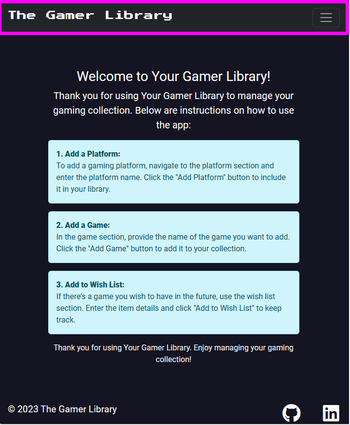
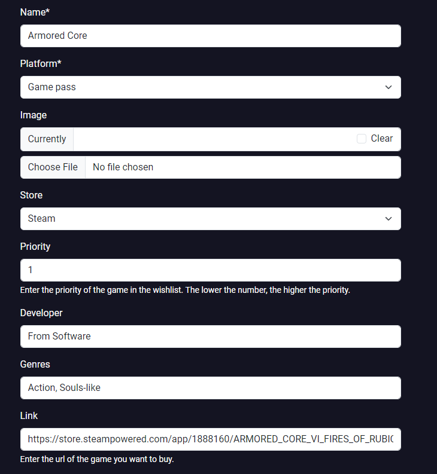

# The Gamer Library

---

## Site Overview

---
Immerse yourself in your passion for gaming with The Gamer Library, an app meticulously crafted to unite your gaming journey across generations and platforms. As a fellow gamer, my gaming odyssey began with the early days of Sonic 2 on the Sega Mega Drive and has continued, spanning up to the latest adventure in Baldur's Gate III.

Understanding the challenges of hardcore gamers in keeping track of their extensive gaming history, The Gamer Library aims to provide a comprehensive solution. In today's digital era, games are available in various formats and scattered across different platforms, each maintaining an independent record. This challenge becomes evident, for example, when attempting to reconcile games played on Game Pass with those in the Steam library. With the rise of cloud gaming, titles frequently shift between platforms, making it easy to lose track of your gaming history.

Adding a game to The Gamer Library goes beyond mere organization; it enhances your gaming satisfaction. There's a unique sense of achievement in conquering the final boss and proudly recording your triumph in the library. Moreover, it takes users on a nostalgic journey, linking specific games to significant moments. I vividly recall playing Digimon World 3 on PS1 when my sister was born, conquering Ornstein and Smough in Dark Souls during my Master's degree, exploring the City of Tears in Hollow Knight with my first job, and immersing myself in Baldur's Gate III builds while crafting this very project.

Embark on a new chapter of gaming with The Gamer Library to celebrate your games! Join The Gamer Library and redefine how you experience and share your love for gaming!

Live link to [The Gamer Library](https://the-gamer-library-a2d80d9a63a6.herokuapp.com/)

## Table of Contents

- [The Gamer Library](#the-gamer-library)
  - [Site Overview](#site-overview)
  - [Table of Contents](#table-of-contents)
  - [Planning phase](#planning-phase)
    - [Strategy](#strategy)
      - [Aims](#aims)
      - [Opportunities](#opportunities)
    - [Scope](#scope)
    - [Structure](#structure)
      - [User stories](#user-stories)
    - [Skeleton](#skeleton)
      - [Wireframes](#wireframes)
      - [Database schema](#database-schema)
    - [Surface](#surface)
      - [Colors](#colors)
      - [Typography](#typography)
  - [Features](#features)
    - [Intro](#intro)
    - [Get in touch](#get-in-touch)
    - [Info](#info)
    - [Login](#login)
    - [Register](#registration)
    - [Home](#home)
    - [Add Platform](#add-platform)
    - [Platform Detail](#platform-detail)
    - [Edit Platform](#edit-platform)
    - [Add Game](#add-game)
    - [Game Detail](#game-detail)
    - [Edit Game](#edit-game)
    - [Add Wishlist Game](#add-wishlist-game)
    - [Wishlist Game detail](#wishlist-game-detail)
    - [Edit WishList Game](#edit-wishlist-game)
    - [Delete modals](#delete-modals)
  - [Future development](#future-development)
  - [Technologies](#technologies)
  - [Credits](#credits)

---

## Planning phase

---

### Strategy

---

#### Aims

The Gamer Library efficiently catalogues all played games and the diverse platforms users have experienced. In today's gaming landscape, options include PCs, streaming services, consoles, and cloud gaming platforms.

The core objective of The Gamer Library is to empower gamers by facilitating meticulous tracking of their gaming history and the corresponding platforms. Beyond this, the platform acknowledges that each gaming service, console, or PC carries its own cost. With The Gamer Library, users can effortlessly monitor the number of games played on each platform, enabling them to evaluate the continued value of associated fees.

Furthermore, The Gamer Library enhances user experience by offering the ability to curate a wishlist. Users can add desired games and even analyze the wish-listed titles on each platform. This functionality aids in strategic decision-making, helping users identify the most convenient platform based on the quantity and priority of wish-listed games.

#### Opportunities

In the table and plot below, you'll find a comprehensive list of features that emerged during the brainstorming step.

| Opportunity/Problem                                 | Importance | Feasibility/Viability |
|-----------------------------------------------------|------------|-----------------------|
| Keep track of games                                 | 5          | 4                     |
| Keep track of platforms                             | 5          | 4                     |
| Create wishlists                                    | 4          | 4                     |
| Allow user to login                                 | 5          | 5                     |
| Provide instructions on how to use the app          | 4          | 5                     |
| Allow other developers to get in touch              | 3          | 5                     |
| Import data from Metacritics and Game database APIs | 2          | 3                     |
| Share game, platforms and wishlist with friends    | 3          | 2                     |
| Allow friends users to exchange messages            | 1          | 1                     |
| Allow friends users to create posts, clips, streams | 2          | 1                     |

### Scope

---

Due to the limited time available, I will focus on implementing features where Importance (I) + Feasibility (F) has the highest value:

- UX **must** address:
  - Allow user to login  
  - Keep track of games
  - Keep track of platforms

- UX **should** address:
  - Create wishlists
  - Provide instructions on how to use the app
  - Allow other developers to get in touch
  - Allow friends users to exchange messages

- UX **could** address:
  - Import data from Metacritics and Game database APIs
  - Share game, platforms and wishlist with friends

- UX **wont** address:
  - Allow friends users to create posts, clips, streams
  - Allow friends users to exchange messages

### Structure

---
The graphic below illustrates the steps a user should take to use The Gamer Library app. I created it using `Lucidchart`.

#### User Stories

I developed The Gamer Library project by following Agile principles. I worked in sprints of 2 weeks each, and at the end of each sprint, I introduced new user stories or rescheduled previous user stories following the MoSCoW rules.

##### Sprint 1

##### 18/12/2023 - 25/12/2023

- **Must have**
  - As a **Developer** I can **access the project on the cloud** so that I **can view and navigate the app on Heroku, just as I do locally**.
  - As a **Admin** I can **create, read, update, and delete platform instances** so that I **can perform CRUD operations on platforms**.
  - As a **Admin** I can **create, read, update, and delete games instances** so that I **can perform CRUD operations on games**.

- **Should have**
  - As a **Admin** I can **see the list of platforms added outside the admin panel** so that I **can verify the platform list view and home page perform as expected**.
  - As a **Admin** I can **see the list of games added outside the admin panel** so that I **can verify the game list view and html template perform as expected**.

##### Sprint 2

##### 25/12/2023 - 08/01/2024

- **Must have**
  - As a **User** I can **add a platform to the app** so that I **can keep track of the platforms I use**.
  - As a **User** I can **add Games to a Platform** so that I **can keep track of the games played on each platform**.

- **Should have**
  - As a **User** I can **log into the app** so that I **can see only my list of platforms and games**.
  - As a **Developer** I can **showcase who I am and my history** so that I **can empathize with the user**.
  
- **Could have**
  - As a **Developer** I can **get in touch with recruiters or other developers** so that I **can receive offers to work on new projects or receive feedback**.

##### Sprint 3

##### 08/01/2024 - 22/01/2024

- **Must have**
  - As a **User** I can **edit a platform instance** so that **I can update the platform or correct mistakes added during creation**.
  - As a **User** I can **delete a platform instance** so that **I can remove platforms from the app**.

- **Could have**
  - As a **Developer** I can **test that a platform is created and its details are visible** so that **I can perform platform CRUD testing without manual intervention**.
  - As a **Developer** I can **verify that the 'Get in Touch' content is displayed without manual testing** so that I can **save time during app testing**.

##### Sprint 4

##### 22/01/2024 - 05/02/2024

- **Must have**
  - As a **User** I can **see game details** so that **I can get information and details on the games I have played**.
  - As a **User** I can **add images to my games** so that **I can customize the game instances I add**.

- **Should have**
  - As a **User** I can **edit my game details** so that **I can customize my games instances**.
  - As a **User** I can **delete a game instance** so that **I can remove unwanted games from my game list**.

##### Sprint 5

##### 05/02/2024 - 19/02/2024

- **Must have**
  - As an **Admin** I can **add wishlist instances** so that **I can manage and view wishlist items from the admin panel**.
  - As a **User** I can **add wishlist items** so that **I can plan and keep track of the games I want to buy**.

- **Should have**
  - As a **User** I can **edit a wishlist item** so that **I can update details such as price and priority**.
  - As a **User** I can **delete wishlist items** so that **I can remove a game I no longer want to buy**.

- **Could have**
  - As a **User** I can **access instructions on how to use the app** so that **I do not feel lost when navigating the home page**.
  - As a **User**, I can **understand what the purpose of the app is** so that **I can decide if it fits my needs**.
  - As a **Developer** I can **test creating, reading, updating, and deleting Platform instances** so that **I can test Platform CRUD without manual input**.
  - As a **Developer** I can **test creating, reading, updating, and deleting Game instances** so that **I can test Game CRUD without manual input**.
  - As a **Developer** I can **test creating, reading, updating and deleting WishListGames instances** so that **I can test WishListGame CRUD without manual input**.
  - As a Developer I can test forms' validity without manual input so that I can speed up and automate the app testing.

##### Sprint 6

##### 19/02/2024 - 29/02/2024

- **Must have**
  - As a **User** I can **access all the details on the app's purpose, planning, and functions** so that **I can make an informed decision on whether it meets my needs**.

- **Should have**
  - As a **Developer** I can **analyze the test coverage percentage for views and forms** so that **I can prioritize manual testing efforts on uncovered areas**.

  - As a **User** I can **seamlessly access the game store directly from the wishlist section of the app** so that **I can conveniently purchase desired games without switching between platforms**.

##### Backlog

- **Wont have**
  - As a **User** I can **add friends to the app** so that **I can share games, platforms and wishlists with them**.
  - As a **User** I can **get Metacritic score, released date, developer and genres fields automatically filled** so that **I can speed up the adding game step**.
  - As a **User** I can **add posts, streams, and game clips** so that **I can share them with friends**.

### Skeleton

---

#### Wireframes

Below are the wireframes I used to create the .html templates for the app.

#### Database schema

Below is the schema I used to implement the main model of The Gamer Library

### Surface

---

#### Colors

Gamers are the primary target audience for The Gamer Library; therefore, I have chosen colors and fonts that immerse users in the gaming world. Indeed, an RGB border surrounds the Navbar that continuously changes color.

Each gaming console/brand has a distinct color: red for Nintendo Switch, green for Xbox, and blue for PlayStation 5. Therefore, I allowed the users to personalize the background color for each platform. This color choice influences the platform box color on the home page and serves as the background color on the platform detail page. If a user selects a dark color as the background, the font in the platform box and platform detail page will not be visible. Therefore, users can change the font color for the platform box on the home page and the platform detail page

For more information, refer to the [Edit platform](#edit-platform) section.

#### Typography

I chose a font which reminds of gaming `Press Start 2 Play`to create the logo and one which combined accordingly `Roboto` for the main content of the app

---

## Features

---

### Navbar

#### Logo

The logo bears the name of the web app surrounded by RGB lights. Both the font, `Press Start 2 Play`, and the RGB lights transport users to the gaming world, establishing a strong connection with gamers.

On small screens, the navbar displays as a hamburger menu.

When clicked, the hamburger menu shows all the available options.

#### Navbar links

The navbar allows not logged-in users to access the following pages:

- [Intro](#intro)
- [Get in touch](#get-in-touch)
- [Info](#info)
- [Login](#login)
- [Register](#registration)

Logged users instead get access to additional pages:

- [Home](#home)
- [Add Platform](#add-platform)
- [Platform Detail](#platform-detail)
- [Edit Platform](#edit-platform)
- [Add Game](#add-game)
- [Game Detail](#game-detail)
- [Edit Game](#edit-game)
- [Add Wishlist Game](#add-wishlist-game)
- [Wishlist Game detail](#wishlist-game-detail)
- [Edit WishList Game](#edit-wishlist-game)
- [Delete modals](#delete-modals)

### Intro

Users who are not logged in will be redirected to the intro page initially. The page showcases three hero images illustrating the main purposes of the app: keeping track of platforms, monitoring game activity, and planning the game wishlist. At the bottom, there are two buttons allowing the user to either log in or sign up.

### Get in touch

The Get in Touch page contains a brief user description. The description is not hardcoded in the HTML page. Instead, the admin can update and modify the message through the admin panel. Positioned at the centre of the page is a hero image serving as a gateway to the gaming world. At the bottom, a collaboration button enables other developers to contact me or provide feedback on the app.

### Info

The Info page provides instructions on how to use the app. After logging in, the user should initially add a platform. Then, the user can edit or delete it. Additionally, he can add games to their collection or wishlist only if he already added a platform.

### Login

The login page enables registered users to log in. Once logged in, users can access the main features of the app, including adding, removing, and editing platforms, games, and wishlist items. If a user is not already logged in, the login page provides a link to the registration page, which users can also access directly from the navbar.

### Registration

Users can log in only if they have registered first. To register, users need to provide a valid username and password, with the email address being optional. The page also displays the password constraints.

### Home

Only logged-in users can access the home page. The home page displays a list of added platforms, showcasing each platform's name and the number of associated games. Clicking on a platform's name redirects the user to the platform page. Below the platform details, two buttons are available. The blue button expands the platform details, revealing the list of games added, including the game name, image, and a user-assigned score ranging from 0 to 100. The red button serves as the delete button, allowing the user to remove the platform. Upon clicking, a modal will appear, prompting the user to confirm the deletion, as this action cannot be undone.

### Add platform

Logged-in users can select the Add Platform link on the navbar to create a new platform. On this page, users can provide a platform name and category, with the image being optional. Both the name and category are mandatory fields. Most of the additional platform details can be edited on the platform detail page.
Verification is performed on the uploaded image. Only the following formats are supported: .png, .webp, .jpg, .jpeg, and .gif.

### Platform detail

Once the user adds a platform, it becomes visible on the home page. The user can click on the platform name to be redirected to the platform detail page. On the platform detail page, the platform image is displayed, with a placeholder shown if none has been chosen. Below, there is the platform name, along with two buttons one to edit the platform details (redirecting to the edit platform form) and a delete button that triggers a modal to confirm platform deletion.

Following the platform details, additional information is displayed based on the chosen category. Each category presents different details. Subsequently, the page lists the games and those added to the wishlist. In the game list, the game image is shown, with a placeholder displayed if none is available. Below the image, the game name and user-assigned score (ranging from 0 to 100) are presented. Clicking on the game name redirects the user to the game detail page.

In the wishlist games list, each entry displays the chosen game image or a placeholder if none has been selected. Additionally, a priority is shown, represented by an integer value where a lower value indicates a higher priority.

### Edit Platform

Logged-in users can click on the blue button to edit platform details, which redirects to a form for editing based on the platform category. Among other options, users can choose a background color and font color. To set both colors, users must enter a HEX code for the selected color.

The background color will determine the color of the platform box on the home page and the background on the platform detail page. By default, the background color is black, and the font color is white. If the user selects a light color as the background, the font might not be visible. Therefore, the form provides the option to change the font color as well. This alteration affects the font color in the platform box on the home page and the platform details on the platform details page.

Furthermore, users have the option to change the category of the platform. However, the attributes of the new category become visible only after saving the new category and clicking the edit button again.

### Add Game

Logged-in users, after adding a platform, can click on the Add Game link in the navbar to associate a game with a platform. They will be redirected to the Add Game form, where only a few attributes are available: Name, Platform, Image, and User Score. Name and Platform are mandatory, while Image and User Score are optional. If no image is added, a placeholder will be displayed.

### Game Detail

After filling out the "Add Game" form, the game becomes visible on the home page after clicking the expand button, and in the platform details page in the game list section. Both the game name on the home page and the game name in the platform detail, by clicking on them, redirect the user to the game detail page.

The game detail page displays the game image or a placeholder if none is chosen, along with the "Edit Game" and "Delete Game" buttons. Clicking the "Edit Game" button redirects to the edit game form page, while the "Delete Game" button prompts a modal for confirming game deletion. Upon confirmation, the game is deleted.

Below, there is a list of game details, including the game review, where a user can express their opinion on the played game.

### Edit Game

On the Game Detail page, the user can click on the Edit Game button to be redirected to the Edit Game page. Here, the user has access to additional attributes such as Developer, Genres, Completion Date, and Hours Spent. Furthermore, there is a text area for the user to write a review for the game.

### Add Wishlist Game

After adding a platform, the user can also add a wishlist game by clicking on the Add Wishlist button in the navbar. Similar to the Add Game and Add Platform pages, only a few attributes are available on the Add Wishlist Game form. The majority of the attributes are accessible in the Edit Wishlist Game form.

In the Add Wishlist Game form, the following attributes are available: Name, Platform, Image, Priority, Currency Cost, and Store. Only the Platform and Name fields are mandatory.

Wishlist games will be visible only on the platform detail page in the Wish List Games section. Details of a wishlist game can be viewed by clicking on the Wishlist game name in the platform detail page.

### Wishlist Game detail

The Wishlist game detail will display the image of the wish-listed game; if none is chosen, a placeholder is displayed. Below, there are the game name, and the Edi" and Delete buttons. The Edit button redirects to the Edit Wish List Game page, while the Delete button prompts a modal to confirm the deletion of the game from the wishlist. At the bottom, all the wish-listed game attributes are displayed.

### Edit Wishlist Game

On the Wishlist Game detail page, users can click on the Edit button to modify various attributes associated with a game added to the wishlist. It's important to note that when updating the date attribute, it must follow the Django format 'YYYY-MM-DD'.

The Priority field is specific to wish-listed games, where users input an integer. The lower the value, the higher the priority for the game. Games in the wishlist with lower priority values will be displayed first.

### Delete Modals

Every delete button once clicked will show a similar modal the one on the picture below and the platform, game or wishlist game will be deleted only if the user selects confirm.

## Future development

---

Future development includes user stories that have been left in backlog following agile principles:

- Utilize API integration to fetch data from the video games database IGDB and Metacritics. This approach enables users to pre-fill most of the data when adding a Game or Wishlisted Game by accessing the APIs.

- Implement the capability for users to add friends. Friends will be able to view each other's platforms, games, and wishlists. This feature proves useful when a user wants to purchase the same platform as a friend. They can view their friend's PC build, including GPU, CPU, and RAM, and make informed decisions. Additionally, friends can gift games from the wishlist as birthday presents!

- Introduce a messaging system, enabling users to exchange messages. This feature can facilitate setting up multiplayer sessions or simply chatting about their favorite games.

- Enable users to share game clips, game content, and potentially even stream live content. This way, the app could foster a community of gamers, allowing them to connect and engage with each other.

## Testing

---
Testing details are included in this separate file [TESTING.md](./TESTING.md)

## Deployment

---
Deployment details are included in this separate file [DEPLOYMENT.md](./DEPLOYMENT.md)

## Technologies

---

Python v3.12.0

- List of packages available in [requirements.txt](./requirements.txt)

Django

- Django was used as the python framework in the project.
- Django all auth was used to handle user authentication and related tasks i.e. sign in, sign up, sign out.

Heroku

- Used as for early and cloud deployment

Elephant SQL

- Used to generate the database used in this project

HTML

- Used to generate the templates in the Django framework

CSS

- Used apply style to the HTML templates

Javascript

- Used to crete modals to delete modal and change background and font color in specific HTML templates based on user choices

Bootstrap 5.3.2

- Used to create preset HTML elements in the Django templates

Fontawesome

- Used to add icon to the HTML templates

## Credits

---

Great thanks to:

- [David Bowels](https://github.com/dnlbowers) for mentoring and support.
- [Lucidchart](https://www.lucidchart.com/pages/) for the generation of the Diagram
- [Code institute](https://codeinstitute.net/) for providing training material
- [Chatgpt](https://openai.com/blog/chatgpt) for assisting in troubleshooting and proofreading
- [Figma](https://www.figma.com/) for the creation of wireframes
- [DraSQL](https://drawsql.app/) for the creation of the database schema
- This project has been developed using VScode
- GitHub was used for version control
- My partner for continuous support and assistance
