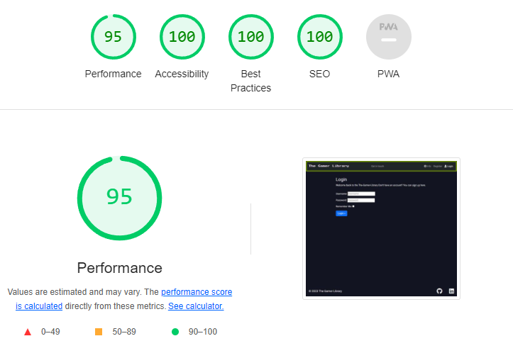

# Table of Contents

- [Manual Testing](#manual-testing)
  - [Bugs and Fixes During the Development Process](#bugs-and-fixes-during-the-development-process)
- [Lighthouse scores](#lighthouse-scores)
- [Validators](#validators)
  - [HTML](#html)
  - [CSS](#css)
  - [JS](#js)

---

## Manual testing

---

### Bugs and Fixes During the Development Process

List of bugs and fixes I applied during the development process:

1. **Error:**
    After running `python manage.py runserver` for the first time the error below appeared:
  
    ```cmd
    File "<frozen importlib._bootstrap_external>", line 1074, in get_code
    File "<frozen importlib._bootstrap_external>", line 1004, in source_to_code
    File "<frozen importlib._bootstrap>", line 241, in _call_with_frames_removed
    File 
      TEMPLATES_DIR os.path.join(BASE_DIR, 'templates')
    SyntaxError: invalid syntax
    ```

    **Cause:**
    There was the syntax error below in file `settings.py`:

    ```python

      SECRET_KEY os.environ.get('SECRET_KEY')
    ```

    **Solution:**
    I corrected the syntax error by adding `=` in `setting.py` , correct code:

    ```python

    SECRET_KEY = os.environ.get('SECRET_KEY')
    ```

1. **Error:**
   After running `python manage.py runserver` the error below appeared:

   ```cmd
    File \env.py", line 6, in <module>
    File "<frozen os>", line 684, in __setitem__
    File "<frozen os>", line 744, in check_str
   TypeError: str expected, not list
   ```
  
    **Cause:**
    Variable `LOCALHOST` was set as a list rather than as a string

      ```python
      os.environ["LOCALHOST"]= ["secret_string"]
      ```

    **Solution:**
    I converted ["LOCALHOST"] into a string:

      ```python
      os.environ["LOCALHOST"]= "secret_string"
      ```

1. **Error:**
   After running `python manage.py runserver` the error below appeared:

   ```bash
    django.core.exceptions.ImproperlyConfigured: In order to use cloudinary storage, you need to provide CLOUDINARY_STORAGE dictionary with CLOUD_NAME, API_SECRET and API_KEY in the settings or set CLOUDINARY_URL variable (or CLOUDINARY_CLOUD_NAME, CLOUDINARY_API_KEY, CLOUDINARY_API_SECRET variables).
    !Error while running '$ python manage.py collectstatic --noinput'.
    See traceback above for details.
    You may need to update application code to resolve this error.
    Or, you can disable collectstatic for this application:
   ```

    **Cause:**
    The error was caused by a formatting issues of Cloudinary settings in `settings.py`

      ```python
      os.environ["CLOUDINARY_URL"]= "my_cloudinary_url"
      ```

    **Solution:**
    To solve the error I added in settings.py :

    ```python
        CLOUDINARY_STORAGE = {
        'CLOUD_NAME': os.environ.get('CLOUDINARY_CLOUD_NAME'),
        'API_KEY': os.environ.get('CLOUDINARY_API_KEY'),
        'API_SECRET': os.environ.get('CLOUDINARY_API_SECRET'),
    }
    ```

    Whereas I added the code below in `env.py`

    ```python
    os.environ["CLOUDINARY_CLOUD_NAME"] = "my_cloud_name"
    os.environ["CLOUDINARY_API_KEY"] = "my_API_key"
    os.environ["CLOUDINARY_API_SECRET"] = "my_API_secret_key"
    ```

1. **Error:**
    The error below occurs during the execution of `python manage.py collectstatic` on Heroku. It specifically complains about missing Cloudinary configuration (`cloud_name`).

    **Cause:**
    The `DISABLE_COLLECTSTATIC` setting in Heroku was named incorrectly as `DISABLE_COLLEC STATIC=1`.

    **Solution:**
    Delete the config variable **DISABLE_COLLEC STATIC=1** and add **DISABLE_COLLECTSTATIC=1**. This will disable the collection of static files during the application's deployment on Heroku.

1. **Error:**
    Many-to-many relation is not visible in the admin panel.

   **Cause:**
    Many-to-many relations have been established using cross-tables (e.g., user-games, user-wishlist).

    **Solution:**
    Revise the model structure and use `ManyToManyField` directly instead of relying on separate cross tables. Update the affected models to use the appropriate many-to-many field to ensure visibility in the admin panel.

1. **Error:**
    Many-to-many relation does not take into consideration game custom fields such as user score and user review.

    **Cause:**
    The issue arises from using a many-to-many relation instead of a one-to-many relation.

    **Solution:**
    To address this, modify the data model to use one-to-many relations. Update the relationships as follows:

    - Change the user-games relation to one-to-many.
    - Change the user-wishlists relation to one-to-many.
    - Introduce a new platform table.
    - Establish a one-to-many relation between user and platform (user-platform).
    - Establish one-to-many relations between platform and games (platform-games) and wishlists (platform-wishlists).

1. **Error:**
    The error below is occurring in the Django admin configuration. It indicates issues with the `filter_horizontal` setting in the `UserProfileAdmin` class and a clash in reverse query names in the `Platform` model. The error specifies that certain fields in the `filter_horizontal` setting must be many-to-many fields, and it suggests solutions for resolving the clash in reverse query names.

    ```cmd
      ERRORS:
      <class 'library.admin.PlatformAdmin'>: (admin.E020) The value of 'filter_horizontal[0]' must be a many-to-many field.
      <class 'library.admin.PlatformAdmin'>: (admin.E020) The value of 'filter_horizontal[1]' must be a many-to-many field.
      <class 'library.admin.UserProfileAdmin'>: (admin.E013) The value of 'filter_horizontal[0]' cannot include the ManyToManyField 'friends', because that field manually specifies a relationship model.
      <class 'library.admin.UserProfileAdmin'>: (admin.E020) The value of 'filter_horizontal[1]' must be a many-to-many field.
      <class 'library.admin.UserProfileAdmin'>: (admin.E020) The value of 'filter_horizontal[2]' must be a many-to-many field.
      <class 'library.admin.UserProfileAdmin'>: (admin.E020) The value of 'filter_horizontal[3]' must be a many-to-many field.
      library.Platform.games: (fields.E303) Reverse query name for 'library.Platform.games' clashes with field name 'library.Game.platform'.
              HINT: Rename field 'library.Game.platform', or add/change a related_name argument to the definition for field 'library.Platform.games'.
      library.Platform.wishlists: (fields.E303) Reverse query name for 'library.Platform.wishlists' clashes with field name 'library.WishList.platform'.
              HINT: Rename field 'library.WishList.platform', or add/change a related_name argument to the definition for field 'library.Platform.wishlists'.
   ```

   **Cause:**
   The error is due to incorrect configuration in `UserProfile` and `FriendList` models. The `filter_horizontal` attribute is being applied to fields that are not many-to-many relationships. Additionally, there is a clash in reverse query names in the `Platform` model.

   **Solution:**
   1. Remove filter_horizontal for non-many-to-many fields in UserProfileAdmin.
   1. Add the related_name attribute to the games and wishlists foreign keys in the Platform model to resolve the clash.

    ```python
    class Platform(models.Model):
    id = models.UUIDField(primary_key=True, default=uuid.uuid4, editable=False)
    platform_name = models.CharField(max_length=255)
    platform_image = models.ImageField(null=True,  blank=True)
    games = models.ForeignKey('Game', on_delete=models.CASCADE, blank=True)
    wishlists = models.ForeignKey('WishList', on_delete=models.CASCADE,  blank=True)
    ```
  
    **Solution**
    Filter horizontal was removed in `admin.py` for `UserProfile` model
    related name attribute added to platform model for the foreign keys

    ```python
    class Platform(models.Model):
    id = models.UUIDField(primary_key=True, default=uuid.uuid4, editable=False)
    platform_name = models.CharField(max_length=255)
    platform_image = models.ImageField(null=True,  blank=True)
    games = models.ForeignKey('Game', on_delete=models.CASCADE, blank=True, related_name='games' )
    wishlists = models.ForeignKey('WishList', on_delete=models.CASCADE,  blank=True, related_name='wish_list')
    ```

1. **Error:**
    The integrity error below occurred during an attempt to add a new record to the `library_platform` table in the Django admin interface. The error indicates a violation of the not-null constraint on the "games_id" column of the "library_platform" table. The failing row contains a record with a null value in the "games_id" column, which is a foreign key referencing the "Game" model.

    ```cmd
    IntegrityError at /admin/library/platform/add/
    null value in column "games_id" of relation "library_platform" violates not-null constraint
    DETAIL:  Failing row contains (c64c5653-4b10-4f1c-a68d-cf1754346e90, Game Pass, , null, null, null).
    Request Method:POST
    Django Version:5.0
    Exception Type:IntegrityError
    Exception Value:
    null value in column "games_id" of relation "library_platform" violates not-null constraint
    DETAIL:  Failing row contains (c64c5653-4b10-4f1c-a68d-cf1754346e90, Game Pass, , null, null, null).
    Exception Location:
   ```

   **Cause:**
   The foreign key field "games" in the "Platform" model is not set to allow null values.

   **Solution:**
   To resolve the issue, the `null=True` parameter should be added to the "games" foreign key field in the "Platform" model:

    ```python
    games = models.ForeignKey(Game, on_delete=models.CASCADE, null=True, blank=True)
    ```

1. **Error:**
    The template platform_list.html does not show platform created

    **Cause:**
    In the HTML template, the platform attributes were called incorrectly. The attributes were referenced as `{{platform.name}}` and `{{plaform.model}}`, which are not the correct attribute names.

    ```html
      <h1>Platforms list</h1>
      
        <h2>{{platform.name}}</h2>
        <p>{{plaform.model}}</p>
      
    ```

    **Solution:**
    Correct the platform attribute names in the HTML template to match the actual attribute names. In this case, it should be `{{platform.platform_name}}`and `{{platform.platform_model}}`.

    ```html
     <h1>Platforms list</h1>
      
        <h2>{{platform.platform_name}}</h2>
        <p>{{platform.platform_model}}</p>
       
    ```

1. **Error:**
   The error below indicates that the template file "add_platform.html" was not found during a GET request to the "/add_platform/" endpoint.

      ```cmd
      TemplateDoesNotExist at /add_platform/
      add_platform.html
      Request Method:GET
      Django Version:5.0
      Exception Type:TemplateDoesNotExist
      Exception Value:
      add_platform.html
   ```

   **Cause:**
   The template file name was missing from the `add_platform` view in the Django application.

   **Solution:**
   To resolve the issue, the "add_platform.html" template file should be added to the `render` function in the `add_platform` view:

   ```python
      def add_platform(request):
        platform_form = AddPlatformForm()

        if request.method == 'POST':
            platform_form = AddPlatformForm(request.POST)
            if platform_form.is_valid():
                platform_form.save()
                # Add any additional logic or redirect here
                return redirect('')

        return render(request,
                      'library/add_platform.html',
                      {'platform_form': platform_form})
   ```

1. **Error:**
    The error below  indicates a problem installing a fixture due to the absence of the "user_id" column in the "library_platform" relation

    ```cmd
    django.db.utils.ProgrammingError: Problem installing fixture ': Could not load library.Platform(pk=00000000-0000-0000-0000-000000000001): column "user_id" of relation "library_platform" does not exist
    LINE 1: ...g', "box_color" = NULL, "font_color" = '#fafafa', "user_id" ...
   ```

   **Cause:**
   The database is corrupted, and the "user_id" column is missing from the "library_platform" relation.

   **Solution:**
    To resolve the issue, it is recommended to reset the database on ElephantSQL or take appropriate measures to fix the corrupted database. This can involve recreating the database or restoring it from a backup.

1. **Error:**
    The error below occurs when attempting to reverse the URL for the 'collaborate' view, but the view function or pattern name is not defined.

    ```cmd
    django.urls.exceptions.NoReverseMatch: Reverse for 'collaborate' not found. 'collaborate' is not a valid view function or pattern name.
    ```

    **Cause:**
    The URL for the 'collaborate' view is not properly defined in the urls.py file.

    **Solution:**
    To fix the issue, add the following line to the urls.py file:

    ```python
      path('collaborate/', views.collaborate, name='collaborate'),
    ```

    This defines the URL pattern for the 'collaborate' view, making it accessible and resolving the NoReverseMatch error.

1. **Error:**
    The UnboundLocalError occurs when trying to access the local variable 'platform' in the `edit_platform` view, but it is not associated with a value:

    ```cmd
    UnboundLocalError at /game-pass/edit_platform/00000000-0000-0000-0000-000000000001/
    cannot access local variable 'platform' where it is not associated with a value
    Request Method:GET
    Request URL:http://127.0.0.1:8000/game-pass/edit_platform/00000000-0000-0000-0000-000000000001/
    Django Version:5.0
    Exception Type:UnboundLocalError
    Exception Value:
    cannot access local variable 'platform' where it is not associated with a value
    Raised during:library.views.edit_platform
    Python Version:3.11.4
   ```

   **Cause:**
   In the views.py file, the form was named `edit_platform_form`, but the variable `form` was called in the HTML template, leading to a mismatch.

   **Solution:**
   Rename the form variable in the views.py file to `edit_platform_form` and use this variable in the HTML template:

   ```html
    <form method="post"  class='white-text' action="">
      
      {{ edit_platform_form|crispy }}
      <button type="submit">Save</button>
    </form>
    ```

1. **Error:**
     The 404 error below occurs when trying to access the platform detail page with an undefined or incorrect platform ID.

    ```cmd
    Page not found (404)
    No Platform matches the given query.
    Request Method:GET
    Request URL:http://127.0.0.1:8000/steam/undefined
    Raised by:library.views.platform_detail
    ```

    **Cause:**
    The `platform.id` was incorrectly assigned as an attribute to the modal button instead of the delete button.

    **Solution:**
    Add `platform.id` to the delete button element to ensure the correct platform ID is used:

     ```html
    <div class="text-center white-text">
      <button class="btn btn-delete btn-danger white-text" data-platformid="{{ platform.id }}" id="deleteButton">Delete</button>
    </div>
    ```

    This correction ensures that the correct platform ID is associated with the delete button and resolves the 404 error.

1. **Error:**
    The error below is triggered in `django.utils.module_loading` while trying to import a string. The issue is caused by a tuple being used instead of a string in the `AUTH_PASSWORD_VALIDATORS` configuration in the `settings.py` file.

    ```cmd
    library\Lib\site-packages\django\utils\module_loading.py", line 25, in import_string
    module_path, class_name = dotted_path.rsplit(".", 1)
                              ^^^^^^^^^^^^^^^^^^
    AttributeError: 'tuple' object has no attribute 'rsplit'
    ```

    **Cause:**
    The `AUTH_PASSWORD_VALIDATORS` configuration in `settings.py` is set using tuples instead of strings, which results in an `AttributeError`.

    ```python
        AUTH_PASSWORD_VALIDATORS = [
        {
            'NAME': ('django.contrib.auth.password_validation.'
                    'UserAttributeSimilarityValidator'),
        },
        {
            'NAME': ('django.contrib.auth.password_validation.'
                    'MinimumLengthValidator'),
        },
        {
            'NAME': ('django.contrib.auth.password_validation.'
                    'CommonPasswordValidator'),
        },
        {
            'NAME': ('django.contrib.auth.password_validation.'
                    'NumericPasswordValidator',)
        },
    ]
    ```

    **Solution:**
    Restore the default configuration in `settings.py` by using strings for each `NAME` value in `AUTH_PASSWORD_VALIDATORS`:

    ```python
      AUTH_PASSWORD_VALIDATORS = [
      {
          'NAME': 'django.contrib.auth.password_validation.UserAttributeSimilarityValidator',
      },
      {
          'NAME': 'django.contrib.auth.password_validation.MinimumLengthValidator',
      },
      {
          'NAME': 'django.contrib.auth.password_validation.CommonPasswordValidator',
      },
      {
          'NAME': 'django.contrib.auth.password_validation.NumericPasswordValidator',
      },
    ]
    ```

    This correction ensures that each `NAME` value is a string, resolving the `AttributeError` caused by using tuples.

1. **Error:**
    The error below occurs when attempting to add a new platform, and it's caused by a null value in the "user_id" column of the "library_platform" relation. The recent update to the Platform model now requires a user to be associated with each platform

    ```cmd
      django.db.utils.IntegrityError: null value in column "user_id" of relation "library_platform" violates not-null constraint
      DETAIL: Failing row contains (4b4415a6-8d18-47c0-addf-9d15235bdb82, test, test, pc, placeholder, null, #fafafa, null).
    ```

    **Cause:**
    The Platform model has been updated, and a user is now a foreign key of the platform. However, when adding a new platform, the user is not being provided, resulting in a null value for "user_id."

    **Solution:**
    To address this issue, the @login_required decorator has been added to the view function. Additionally, the user is explicitly passed during the form save operation to ensure that the "user_id" is properly set:

    ```python
      @login_required
      def add_platform(request):
      if request.method == 'POST':
          add_platform_form = AddPlatformForm(request.POST)
          if add_platform_form.is_valid():
              add_platform_form.save(user=request.user)
              messages.add_message(request, messages.SUCCESS,
                                  'new platform added')
              return redirect('home')
          else:
              messages.error(request, 'Error adding the platform. Please check'
                            'the form.')
      else:
          add_platform_form = AddPlatformForm()

      return render(request,
                    'library/add_platform.html',
                    {'add_platform_form': add_platform_form})
    
    ```

    This modification ensures that the user is associated with the new platform, resolving the IntegrityError.

1. **Error:**
   The error below occurs when attempting to delete a platform, and it's caused by the absence of the expected 'slug' parameter in the delete_platform view function.

    ```cmd
     TypeError at /3r23r23r/delete_platform/6463b2fe-6a98-43ec-9817-9bbc33b30222/
     delete_platform() got an unexpected keyword argument 'slug'
    ```

    **Cause:**
    The URL to delete a platform requires the 'slug' as a parameter, but it seems that the 'slug' parameter was removed from the `delete_platform` view.

    **Solution:**
    To resolve this issue, the 'slug' parameter needs to be added back to the `delete_platform` view in order to match the expected URL structure:

    ```python
    def delete_platform(request, slug):
    # Existing code for deleting platform
    # ...
    ```

    By ensuring that the 'slug' parameter is present in the view function, it aligns with the URL structure, resolving the unexpected keyword argument error.

1. **Error:**
   The issue arises when the expand button on `index.html` is not functioning as expected, specifically it expands but fails to collapse.

   **Cause:**
   The problem is attributed to an interference between Bootstrap versions. Bootstrap is imported multiple times in the HTML, including different versions and scripts that might conflict with each other.

    ```html
      <script src="https://cdn.jsdelivr.net/npm/@popperjs/core@2.11.8/dist/umd/popper.min.js" integrity="sha384-I7E8VVD/ismYTF4hNIPjVp/Zjvgyol6VFvRkX/vR+Vc4jQkC+hVqc2pM8ODewa9r" crossorigin="anonymous"></script>
      <script src="https://cdn.jsdelivr.net/npm/bootstrap@5.3.2/dist/js/bootstrap.min.js" integrity="sha384-BBtl+eGJRgqQAUMxJ7pMwbEyER4l1g+O15P+16Ep7Q9Q+zqX6gSbd85u4mG4QzX+" crossorigin="anonymous"></script>
      <script src="https://cdn.jsdelivr.net/npm/bootstrap@5.3.2/dist/js/bootstrap.bundle.min.js" integrity="sha384-C6RzsynM9kWDrMNeT87bh95OGNyZPhcTNXj1NW7RuBCsyN/o0jlpcV8Qyq46cDfL" crossorigin="anonymous"></script>
      <script src=""></script>
    ```

    **Solution:**
    To resolve the issue, it is recommended to keep only the Bootstrap bundle script, which includes both popper and Bootstrap functionality. Remove the other two lines that import individual scripts.

    ```html
     <script src="https://cdn.jsdelivr.net/npm/bootstrap@5.3.2/dist/js/bootstrap.bundle.min.js" integrity="sha384-C6RzsynM9kWDrMNeT87bh95OGNyZPhcTNXj1NW7RuBCsyN/o0jlpcV8Qyq46cDfL" crossorigin="anonymous"></script>
    ```

1. **Error:**
   The error below occurs when a user tries to add a platform with the same name as a platform owned by another user. The issue lies in the fact that the URL for `platform details`, `add platform`, and `remove platform` includes only the slug, resulting in duplicate slugs for platforms with the same name.

     ```cmd
     IntegrityError at /add_platform/
    duplicate key value violates unique constraint "library_platform_slug_key"
      DETAIL:  Key (slug)=(test) already exists.
    ```

    **Cause:**
    The URL structure for `platform details`, `add platform`, and `remove platform` lacks a unique identifier for each user, leading to the possibility of duplicate slugs when users add platforms with the same name.

    **Solution:**
    To resolve this issue, the user's ID has been added to the URL for `platform details`, `add platform`, and `remove platform`. This ensures that the URL is unique for each user, preventing conflicts with duplicate slugs:

     ```python
    urlpatterns = [
        path('', views.PlatformList.as_view(), name='home'),
        path('add_game/', views.add_game, name='add_game'),
        path('add_platform/', views.add_platform, name='add_platform'),
        path('<int:user_id>/<slug:slug>/', views.platform_detail,
            name='platform_detail'),
        path('<int:user_id>/<slug:slug>/edit_platform/<uuid:platform_id>/',
            views.edit_platform, name='edit_platform'),
        path('<int:user_id>/<slug:slug>/delete_platform/<uuid:platform_id>/',
            views.delete_platform, name='delete_platform'),
    ]
    ```

1. **Error:**
    Users are experiencing a privacy issue where they can see platforms owned by other users when attempting to add a game to a platform. This occurs due to a lack of filtering in the `forms.py` file for the `add game` form.

    **Cause:**
    The platforms were not properly filtered in the `forms.py` file for the `add game form. As a result, users are presented with a list of all platforms, including those owned by other users.

    **Solution:**
    To address this issue, a filter has been added in the `forms.py` file for the `add game` form. The filter ensures that only platforms owned by the current user are visible in the form:

    ```python
    def __init__(self, user, *args, **kwargs):
        super(AddGameForm, self).__init__(*args, **kwargs)
        # Filter platforms based on the current user
        self.fields['platform'].queryset = Platform.objects.filter(user=user)
    ```

1. **Error:**
    Users are unable to upload images to Cloudinary when using the provided form. This issue arises from missing relevant fields in both the HTML template and the corresponding view.

    **Cause:**
    The form in the HTML template and the associated view were lacking the necessary fields to handle file uploads. Specifically, the `enctype="multipart/form-data"` attribute was not set in the HTML form, and the view did not include `request.FILES` when processing the form.

    **Solution:**
    To resolve this issue, the `enctype="multipart/form-data"` attribute has been added to the HTML form to handle file uploads. Additionally, the view has been updated to include `request.FILES` when processing the form:

     ```python
    @login_required
    def add_platform(request):
        if request.method == 'POST':
            add_platform_form = AddPlatformForm(request.POST, request.FILES)
            if add_platform_form.is_valid():
                platform_name = add_platform_form.cleaned_data['name']
    ```

    ```html
      <form method="post" class="white-text" enctype="multipart/form-data" action="">
        
        {{ add_platform_form|crispy }}
        <button type="submit" class="btn btn-primary">Add Platform</button>
    </form>

    ```

1. **Error:**
    Encountered the error below while creating the edit game form, specifically related to the `completion_date` field in the `Game` model. The error indicates that `completion_date` cannot be specified for the Game model form as it is a non-editable field.

    **Cause:**
    The issue arises from adding `auto_now_add=True` to the `completion_date` field in the `Game` model. This attribute makes the field non-editable.

    **Solution:**
    To address this, the `auto_now_add=True` attribute has been replaced with `default=models.functions.Now` in the `Game` model. This change sets the current date as the default value for the field while allowing it to be edited.

1. **Error:**
    Encountered the error below when creating the `edit game` view. The error message indicates a `NoReverseMatch` while attempting to find the URL pattern for 'edit_game' with specific arguments. The arguments include user_id, an empty string, and 'test2', and the attempted pattern does not match.

     ```cmd
    NoReverseMatch at /1/games-pass/test2/
    Reverse for 'edit_game' with arguments '(1, '', 'test2')' not found. 1 pattern(s) tried: ['(?P<user_id>[0-9]+)/(?P<platform_slug>[-a-zA-Z0-9_]+)/(?P<game_slug>[-a-zA-Z0-9_]+)/edit_game/\\Z']
    ```

    **Cause:**
    The issue arises from the `game_detail` view not returning the instance of the platform, which is required to form the URL for the 'edit_game' view.

    **Solution:**
    To resolve this, the instance of the platform has been added to the return statement in the `game_detail` view. Now, the `game_detail` view returns the platform instance along with the game instance:

    ```python
    user = request.user
      platform = get_object_or_404(Platform, user=user, slug=platform_slug)
      game = get_object_or_404(Game, platform=platform, slug=game_slug)

      return render(
          request,
          "library/game_detail.html",
          {
          "platform": platform,
          "game": game},
      )
   ```

   This modification ensures that the platform information is available for generating the 'edit_game' URL in the `game_detail` view.

1. **Error:**
    Encountered an issue where the slug attributes for Platform and Gamer instances do not update after edits. Additionally, the URL continues to use the outdated slug.

    **Cause:**
    The problem arises because, after editing an instance, the slug attribute does not get updated automatically.

    **Solution:**
    To address this issue, the solution involves updating the URLs to use the platform, game, and wishlist_game IDs instead of relying on the slug. This ensures that changes made to the instances are accurately reflected in the URLs.

## Lighthouse scores

- **intro.html**.

 

- **get_in_touch.html**.

  

- **info.html**.

  

- **login.html**.

 
  
- **signup.html**.


- **index.html**.


- **add_platform_form.html**.


- **platform_detail.html**.


- **add_game_form.html**.


- **game_detail.html**.


- **add_wishlist_form.html**.


- **wishlist_game_detail.html**.


## Validators

---

### HTML

---
Due to the nature of Django templates, which may not strictly adhere to W3C validation standards, I initially viewed the pages in Chrome. Subsequently, I used the 'View Page Source' option to obtain the complete .html files. I then input these files into the W3C HTML validator. I tested the pages:
    - **including intro.html**
    - **info.html**
    - **get_in_touch.html**
    - **index.html**
    - **add_platform_form.html**
    - **platform_detail.html**
    - **add_game_form.html**
    - **game_detail.html**
    - **add_wishlist_game_form.html**
    - **wishlist_game_detail.html**
    - **login.html**
    - **signup.html**

Employing the aforementioned method. Fortunately, no errors or warnings were identified for any of these pages.

### CSS

---

For this project, I employed a single customized .css file named style.css. After applying the W3C CSS validator, I confirmed that no errors were detected.

### JS

---

For this project, I employed a single customized .js file named script.js. No errors were returned from the validator.

The validator flagged the following warnings:

- One undefined variable at line 23 for 'bootstrap'.
- One undefined variable at line 32 for 'bootstrap'.
- One undefined variable at line 41 for 'bootstrap'.

These warnings are due to the external Bootstrap library used in the script, which the validator is not aware of.